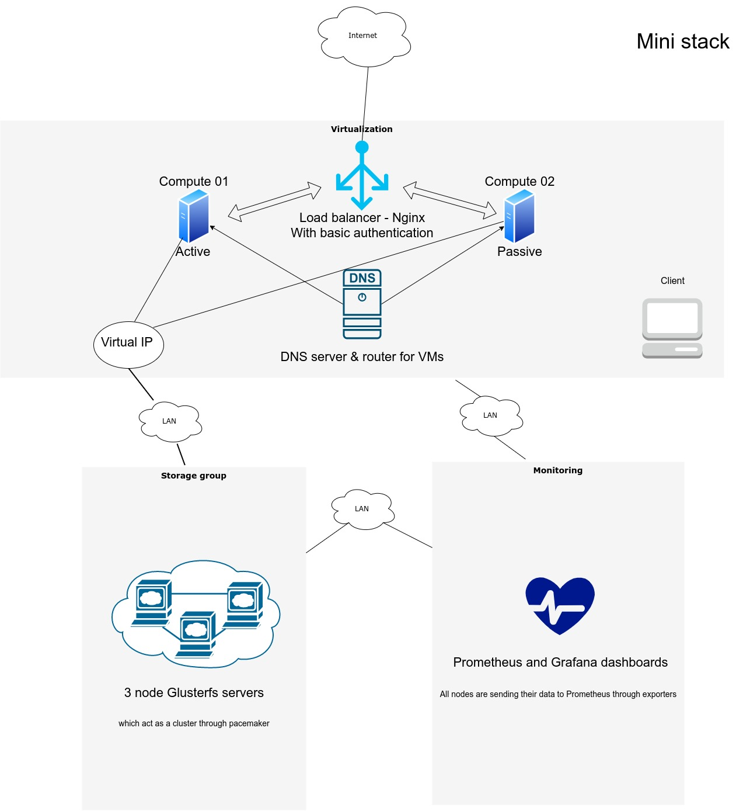
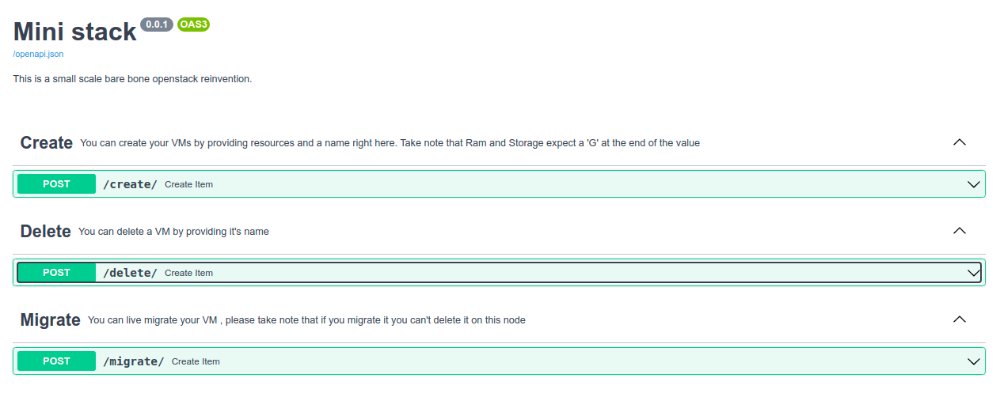
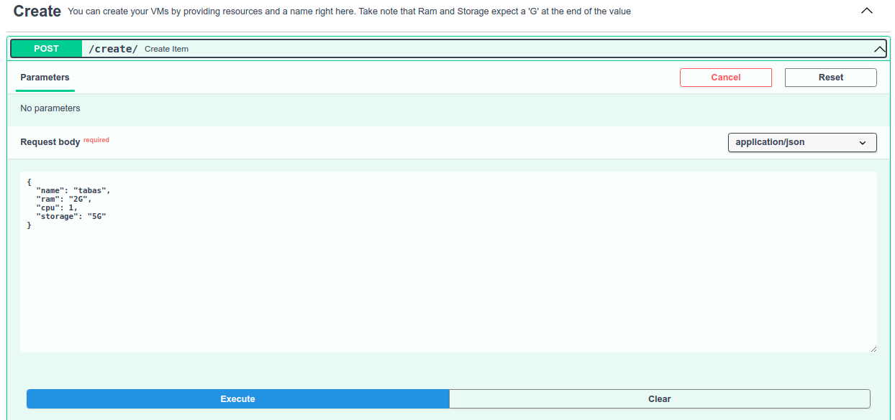
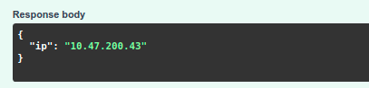

# Abstract:

This project is a small scale cloud management solution which basically has three main parts:
1. Virtualization
2. Distributed storage
3. Monitoring

Through these building blocks you can create VMs seamlessly and manage them via a web API and by utilising distributed storage you are able to live migrate your VMs and provide a highly available service



## Network addressing of our environment:

Network group | Node name | IP address
------------ |------------ | -------------
Gluster | master1 | 192.168.99.101
Gluster | master2 | 192.168.99.102
Gluster | master3 | 192.168.99.103
Gluster | virtual IP | 192.168.99.100
Virtualization | compute01 | 10.47.100.3
Virtualization | compute02 | 10.47.100.4
Virtualization | DNS server | 10.47.100.5
Virtualization | loadbalancer | 10.47.100.11
Monitoring | monitoring | 10.47.100.20 , 192.168.99.8

## Storage:

We will create a glusterfs cluster as our storage backend and serve files through Ganesha which basically is an abstraction layer to plug in different storage backends. Then we will create a high available cluster out of it using pacemaker and corosync by providing a floating ip in order to reach one of our gluster servers and in case if one of them failed pacemaker and corosync will replace will replace it immediately so users won't notice any outage in our service. This guide is based on the resource provided by [Oracle.](https://oracle.github.io/linux-labs/HA-NFS/)

Our components in more detail are :
    Corosync provides clustering infrastructure to manage which nodes are involved, their communication and quorum
    Pacemaker manages cluster resources and rules of their behavior
    Gluster is a scalable and distributed filesystem
    Ganesha is an NFS server which can use many different backing filesystem types including Gluster


Set DNS to Shecan

```
vi /etc/resolve.conf
nameserver 178.22.122.100
```

Install necessary packages

```
sudo -s
dnf update

#https://www.server-world.info/en/note?os=CentOS_8&p=glusterfs7&f=4

dnf -y install centos-release-nfs-ganesha30 
sed -i -e "s/enabled=1/enabled=0/g" /etc/yum.repos.d/CentOS-NFS-Ganesha-3.repo 
 dnf --enablerepo=centos-nfs-ganesha3 -y install nfs-ganesha-gluster 
 mv /etc/ganesha/ganesha.conf /etc/ganesha/ganesha.conf.org 
 
 #https://www.server-world.info/en/note?os=CentOS_8&p=pacemaker&f=1
 
dnf --enablerepo=ha -y install corosync pacemaker pcs 

#https://kifarunix.com/install-and-setup-glusterfs-storage-cluster-on-centos-8/

dnf -y install centos-release-gluster
dnf config-manager --set-enabled PowerTools
dnf -y install glusterfs-server
```

Create the Gluster volume
I attached a 20GB spare disk to my vms on /dev/vdb so change it with your own spare volume which can be seen through utilising `lsblk` command
(On all masters) Create an XFS filesystem on /dev/vdb with a label of gluster-000

```
mkfs.xfs -f -i size=512 -L gluster-000 /dev/vdb

```

(On all masters) Create a mountpoint, add an fstab(5) entry for a disk with the label gluster-000 and mount the filesystem 

```
mkdir -p /data/glusterfs/sharedvol/mybrick
echo 'LABEL=gluster-000 /data/glusterfs/sharedvol/mybrick xfs defaults  0 0' >> /etc/fstab
mount /data/glusterfs/sharedvol/mybrick
```

(On all masters) Enable and start the Gluster service 

```
systemctl enable --now glusterd
```

On master1: Create the Gluster environment by adding peers - I changed /etc/hosts by hand and entered ip addrreses of my nodes to that so that master2 and 3 can be resolvable- 

```
gluster peer probe master2
gluster peer probe master3
#you should see peer probe: success. as the output
gluster peer status
#you should see Number of Peers: 2 as the output
```

Show that our peers have joined the environment

On master2&3:
```
gluster peer status
#you should see Number of Peers: 2 as the output
```

On master1: Create a Gluster volume named sharedvol which is replicated across our three hosts: master1, master2 and master3. 

```
gluster volume create sharedvol replica 3 master{1,2,3}:/data/glusterfs/sharedvol/mybrick/brick
```

On master1: Enable our Gluster volume named sharedvol

```
gluster volume start sharedvol
```

Our replicated Gluster volume is now available and can be verified from any master so make sure you see the same output by running this command on every master node

```
gluster volume info
```

Configure Ganesha

Ganesha is the NFS server that shares out the Gluster volume. In this example we allow any NFS client to connect to our NFS share with read/write permissions. 

(On all masters) Populate the file /etc/ganesha/ganesha.conf with our configuration 

```
vi /etc/ganesha/ganesha.conf
EXPORT{
    Export_Id = 1 ;       # Unique identifier for each EXPORT (share)
    Path = "/sharedvol";  # Export path of our NFS share

    FSAL {
        name = GLUSTER;          # Backing type is Gluster
        hostname = "localhost";  # Hostname of Gluster server
        volume = "sharedvol";    # The name of our Gluster volume
    }

    Access_type = RW;          # Export access permissions
    Squash = No_root_squash;   # Control NFS root squashing
    Disable_ACL = FALSE;       # Enable NFSv4 ACLs
    Pseudo = "/sharedvol";     # NFSv4 pseudo path for our NFS share
    Protocols = "3","4" ;      # NFS protocols supported
    Transports = "UDP","TCP" ; # Transport protocols supported
    SecType = "sys";           # NFS Security flavors supported
}
```

Create a Cluster

You will create and start a Pacemaker/Corosync cluster made of our three master nodes

(On all masters) Set a shared password of your choice for the user hacluster

```
passwd hacluster
```

(On all masters) Enable the Corosync and Pacemaker services. Enable and start the configuration system service 

```
systemctl enable corosync
systemctl enable pacemaker
systemctl enable --now pcsd
```

On master1: Authenticate with all cluster nodes using the hacluster user and password defined above

```
pcs host auth master1 master2 master3 -u hacluster -p examplepassword
```

On master1: Create a cluster named HA-NFS 

```
pcs cluster setup HA-NFS master1 master2 master3
```

On master1: Start the cluster on all nodes 

```
pcs cluster start --all
```

On master1: Enable the cluster to run on all nodes at boot time 

```
pcs cluster enable --all
``` 

On master1: Disable STONITH 
based on Wikipedia
> STONITH ("Shoot The Other Node In The Head" or "Shoot The Offending Node In The Head"), sometimes called STOMITH ("Shoot The Other Member/Machine In The Head"), is a technique for fencing in computer clusters.
Fencing is the isolation of a failed node so that it does not cause disruption to a computer cluster. As its name suggests, STONITH fences failed nodes by resetting or powering down the failed node. 

```
pcs property set stonith-enabled=false
```

Our cluster is now running

On any master by running the following command you should see the same output:

```
pcs cluster status
```

Create Cluster services

You will create a Pacemaker resource group that contains the resources necessary to host NFS services from (192.168.99.100)

On master1: Create a systemd based cluster resource to ensure nfs-ganesha is running 
    
```
pcs resource create nfs_server systemd:nfs-ganesha op monitor interval=10s
```

On master1: Create a IP cluster resource used to present the NFS server 

```
pcs resource create nfs_ip ocf:heartbeat:IPaddr2 ip=192.168.99.100 cidr_netmask=24 op monitor interval=10s
```

On master1: Join the Ganesha service and IP resource in a group to ensure they remain together on the same host 

```
pcs resource group add nfs_group nfs_server nfs_ip
```

Our service is now running , you can make sure about that by running :

```
pcs status
```

You may test the availability of your service by following these steps,
On master1: Identify the host running the nfs_group resources and put it in standby mode to stop running services

```
pcs node standby master1
#Verify that the nfs_group resources have moved to another node
pcs status
#Bring our standby node back into the cluster
pcs node unstandby master1
```
At this point we have a virtual IP address which serves our distributed stroage service , with that in hand we can move on to the next stage.

## Virtualization:

### Setting up DNS node:

Because we want to run our vms on a bridge mode network so we can access them from other nodes which reside in the same network and based on research and what articles over internet suggest you can't get ip address of vms in bridge mode easily through commands like ` virsh domifaddr [vm_name] ` so we need a dhcp server in place I went with dnsmasq because it provides the functionality of both a DHCP and a DNS server and it is lightweight nature.
I prepared a single cpu and 2 GB ram Centos8 ready system for running dnsmasq

```
yum install dnsmasq
systemctl start dnsmasq
systemctl enable dnsmasq
systemctl status dnsmasq
```

Configuring dnsmasq Server in CentOS and RHEL Linux

```
cp /etc/dnsmasq.conf /etc/dnsmasq.conf.orig
vi /etc/dnsmasq.conf 
```
change listen-address which is used to set the IP address, where dnsmasq will listen on

```
listen-address=::1,127.0.0.1,10.47.100.5 #change the second address with your dns server IP
interface=eth1 #you can restrict the interface dnsmasq listens on using the interface option
expand-hosts #If you want to have a domain (which you can set as shown next) automatically added to simple names in a hosts-file, uncomment the expand-hosts option.
domain=arvan.lan # set the domain name
# Google's nameservers ,upstream DNS server for non-local domains 
server=8.8.8.8
server=8.8.4.4
#force your local domain to an IP address(es) using the address option as shown
address=/arvan.lan/127.0.0.1 
address=/arvan.lan/10.47.100.5

#enable the DHCP server
dhcp-range=10.47.200.1,10.47.200.50,12h #set your ip range
dhcp-leasefile=/var/lib/dnsmasq/dnsmasq.leases # where DHCP server will keep its lease database
dhcp-authoritative

```

check the configuration file syntax for errors as shown

```
dnsmasq --test
```


Configuring dnsmasq with /etc/resolv.conf File

```
vi /etc/resolv.conf
nameserver 127.0.0.1
```

The /etc/resolv.conf file is maintained by a local daemon especially the NetworkManager, therefore any user-made changes will be overwritten. To prevent this

```
chattr +i /etc/resolv.conf
lsattr /etc/resolv.conf
```

 The Dnsmasq reads all the DNS hosts and names from the /etc/hosts file, so add your DNS hosts IP addresses and name pairs as shown.
 
```
compute01 10.47.100.3
compute02 10.47.100.4
```

To apply the above changes, restart the dnsmasq service as shown.

```
systemctl restart dnsmasq
```

Testing Local DNS

To test if the local DNS server or forwarding is working fine, you need to use tools such as dig or nslookup for performing DNS queries. 

```
yum install bind-utils # remember to install it on every compute node as well because we need it later on
dig arvan.lan
```

The VMs will not have any internet access because the default route in them is set to the ip address of our local DNS which is `10.47.100.5` in our case so in order to make sure DNS server act as a router we need to install iptables on it - centos8 does not have it by default - so follow along.

Enable ip forwarding

```
sysctl -w net.ipv4.ip_forward=1
```

Installing iptables 

```
sudo yum install iptables-services -y
sudo systemctl start iptables
sudo systemctl enable iptables
```

Set iptables rules accordingly

```
iptables -F # flush the default rules
iptables --table nat --append POSTROUTING --out-interface eth0 -j MASQUERADE
```

### Setting up client node:

I also brought up a client in the network which our virtualization nodes reside so that I can ssh to my VMs through this node , I chose centos8 as my OS and minimum requirement would satisfy our needs.
Create a ssh key

```
ssh-keygen
```

Copy the ssh public key to our compute nodes so that they can copy it to our VMs

```
#change compute01 and compute02 with your ip addresses
scp /home/centos/.ssh/id_rsa.public centos@compute01:/home/centos/libvirt-scripts/ssh-keys
scp /home/centos/.ssh/id_rsa.public centos@compute02:/home/centos/libvirt-scripts/ssh-keys
```

### Setting up compute nodes:

[My main resource here was this](https://blog.doublej472.com/post/libvirt-cluster/)

Each virtual machine should be setup identically, with only the hostname and local IP addresses being different. First, since we are putting the VMs on the same network segment as the host machine, we need to setup a network bridge. 

Bridged mode operates on Layer 2 of the OSI model. When used, all of the guest virtual machines will appear on the same subnet as the host physical machine. The most common use cases for bridged mode include:
Deploying guest virtual machines in an existing network alongside host physical machines making the difference between virtual and physical machines transparent to the end user.
Deploying guest virtual machines without making any changes to existing physical network configuration settings.
Deploying guest virtual machines which must be easily accessible to an existing physical network. Placing guest virtual machines on a physical network where they must access services within an existing broadcast domain, such as DHCP.
Connecting guest virtual machines to an exsting network where VLANs are used.


CentOS 8 uses NetworkManager as it's default networking daemon, so we will be configuring that.

```
sudo nmcli con add type bridge ifname br0
sudo nmcli con add type bridge-slave ifname eth1 master br0

#I will also disable Spanning Tree Protocol (STP) on the bridge to speed up network startup significantly. Make sure there are no loops in your network! If you can't remove the loops in your network, then you need to leave STP enabled.
sudo nmcli con modify bridge-br0 bridge.stp no
```

Now setup the IP configuration like your primary networking device, along with your DNS settings. If you don't know what to put in for ipv4.dns-search, then you don't need to set it. You would want it only if your home network uses a domain (my network is set to use arvan.lan).

```
sudo nmcli con modify bridge-br0 ipv4.addresses 10.47.100.3/16
sudo nmcli con modify bridge-br0 ipv4.gateway 10.47.0.1
sudo nmcli con modify bridge-br0 ipv4.dns 10.47.100.5
sudo nmcli con modify bridge-br0 ipv4.dns-search arvan.lan
```

If your network bridge slave device is being used already, then the bridge will not start. Simply activate the network slave device to bring up your bridge. If your network is misconfigured, this is where you may lose your SSH session!

```
sudo nmcli con up bridge-slave-eth1
```

Check to make sure everything is configured correctly.You might need to wait ~10 seconds for any input to be returned:

```
watch ip a show br1
```

Now we need to install and configure libvirt. 
```
dnf update
sudo yum install -y libvirt-daemon libvirt-admin libvirt-client \
  libvirt-daemon-kvm libvirt-daemon-driver-qemu \
  libvirt-daemon-driver-network libvirt-daemon-driver-storage \
  libvirt-daemon-driver-storage-core virt-install nfs-utils
sudo systemctl enable libvirtd
sudo systemctl start libvirtd
```

You need to disable selinux as default security driver because it gets in our way and we are testing it in a lab environment we can simply disable selinux completely or change the security driver settings as described below:

```
vi /etc/libvirt/qemu.conf 
#change 
security_driver = "none"
systemctl restart libvirtd
```

Now we need to setup the storage backend, with the local directory being at /data/vms:

```
sudo mkdir -p /data/vms
sudo virsh pool-define-as \
  --name vmstorage --type netfs \
  --source-host 192.168.99.100 --source-path /sharedvol \
  --source-format auto --target /data/vms
sudo virsh pool-autostart vmstorage
sudo virsh pool-start vmstorage
```


[According to RedHat](https://access.redhat.com/documentation/en-us/red_hat_enterprise_linux/6/html/virtualization_administration_guide/chap-virtualization_administration_guide-storage_pools-storage_pools):

> Suppose a storage administrator responsible for an NFS server creates a share to store guest virtual machines' data. The system administrator defines a pool on the host physical machine with the details of the share (nfs.example.com:/path/to/share should be mounted on /vm_data). When the pool is started, libvirt mounts the share on the specified directory, just as if the system administrator logged in and executed mount nfs.example.com:/path/to/share /vmdata. If the pool is configured to autostart, libvirt ensures that the NFS share is mounted on the directory specified when libvirt is started.
Once the pool starts, the files that the NFS share, are reported as volumes, and the storage volumes' paths are then queried using the libvirt APIs. The volumes' paths can then be copied into the section of a guest virtual machine's XML definition file describing the source storage for the guest virtual machine's block devices. With NFS, applications using the libvirt APIs can create and delete volumes in the pool (files within the NFS share) up to the limit of the size of the pool (the maximum storage capacity of the share). Not all pool types support creating and deleting volumes. Stopping the pool negates the start operation, in this case, unmounts the NFS share. The data on the share is not modified by the destroy operation, despite the name. See man virsh for more details. 


At this point you can create working virtual machines manually, but that takes too long! I want to spin up virtual machines fast. To do that, we need to use cloud-init enabled images. I will be using the ubuntu Focal cloud-init image here as an example.


```
sudo curl -L \
http://cloud-images.ubuntu.com/focal/current/focal-server-cloudimg-amd64.img -o /data/vms/focal-server-cloudimg-amd64.qcow2
sudo virsh pool-refresh vmstorage
```

Don't use the base image directly! You want to create copies of that file for each VM, which can either be done with cp for normal copies, or qemu-img if you want to create a copy-on-write copy which reduces disk space significantly by only storing the difference between the base image and the VM.

```
sudo su -
git clone https://github.com/savi0r/Ministack.git
cd Ministack
cp -r libvirt-scripts /home/centos/
cd /home/centos/libvirt-scripts
```

for the sake of test run the script using the following command 

```
./create-vm.sh test arvan.lan 1 $((2*1024)) 10G \
  /data/vms/focal-server-cloudimg-amd64.qcow2 debian $(./gen-mac-address.sh)

virsh list # you must see your vm name in the ouput
```

In order to be able to do migration you need to set make the node names resolvable through these steps: -on each copute node-

```
vi /etc/hosts#then add these parameters
10.47.100.3 compute01.novalocal
10.47.100.4 compute02.novalocal
```

And then copy **root** user ssh key to another node:  -on each copute node-

```
#we should create a ssh key if there isn't any
ssh-keygen
ssh-copy-id compute02.novalocal
```

Introduce the API as a systemd service:

```
#Create a systemd unit file with these content
vi /etc/systemd/system/api.service

[Unit]
Description=VM manager API
After=multi-user.target

[Service]
Type=simple
Restart=always
ExecStart=/usr/bin/python3 /home/centos/libvirt-scripts/main.py

[Install]
WantedBy=multi-user.target
```

Now start & enable API service:

```
systemctl start api.service
systemctl enable api.service
#check the output to make sure there is no error
systemctl status api.service
```


### Setting up load balancer node:


Because our compute nodes are seperate from each other and there is no orcherstration in place every one of them can become a single point of failure so I decided to tackle this problem by using redundant systems as if one compute node become the primary node and keep in service until it goes down then another compute node will takes it's place which is simply an active/passive solution. I managed to do it by configuring Nginx as my loadbalancer to the API on every compute node


```
####################################
#
#          loadbalancer
#         /           \
#  Compute Node A Compute Node B
#    (active)           (passive)
#
####################################
```


Install nginx package using the yum command on CentOS 8

```
sudo yum update
sudo yum install nginx
```

We also want to make sure that we protect our API from unprivileged users and attackers as well because our API can utilize our resources in any possible way so it is better to be protected. I just made a basic authentication for the sake of demo.
[for further information check this website.](https://docs.nginx.com/nginx/admin-guide/security-controls/configuring-http-basic-authentication/)

```
yum install -y httpd-tools
mkdir -p /etc/apache2
sudo htpasswd /etc/apache2/.htpasswd admin # admin is the name of the user , and you must provide a password here
#make sure the file exists
cat /etc/apache2/.htpasswd
```


Add the following configuration to your nginx config in the specified fields `sudo vi /etc/nginx/nginx.conf`

Useful resources:

https://www.thekua.com/atwork/2009/04/active-passive-load-balancer-configuration-for-nginx/

https://easycloudsupport.zendesk.com/hc/en-us/articles/360002057472-How-to-Fix-504-Gateway-Timeout-using-Nginx

https://docs.viblast.com/player/cors/cors-on-nginx

```
http{

       ............
       
	upstream backend {
	    server 10.47.100.3:8000 fail_timeout=5s max_fails=1; # active node
            server 10.47.100.4:8000     backup;  #passive node
	    }
	#Increase request timeout because one of our request takes about 4 minutes
        proxy_read_timeout 300;
        proxy_connect_timeout 300;
        proxy_send_timeout 300; 
	............
	server{
	............
#Enable these headers because of CORS problems
	add_header 'Access-Control-Allow-Credentials' 'true';
        add_header 'Access-Control-Allow-Headers' 'Authorization,Accept,Origin,DNT,X-Chisel-Proxied-Url,Keep-Alive,User-Agent,X-Requested-With,If-Modified-Since,Cache-Control,Content-Type,Content-Range,Range';
        add_header 'Access-Control-Allow-Methods' 'GET,POST,OPTIONS,PUT,DELETE,PATCH';

        proxy_redirect off;
        proxy_set_header Host $proxy_host;
        proxy_set_header X-Real-IP $remote_addr;
        proxy_set_header Access-Control-Allow-Origin *;
    
	    
	    location / {
	            auth_basic           “Administrator’s Area”;
	            auth_basic_user_file /etc/apache2/.htpasswd;
		    proxy_pass http://backend;
		}
#for extarcting metrics
	    location = /stub_status {
            	    stub_status;
        	}

	............
	}
	............
}
```

if SELnux is enabled, change boolean setting. or simply change selinux to disabled mode via `vi /etc/selinux/config/`

```
setsebool -P httpd_can_network_connect on   
```


Enable and start Nginx server 

```
sudo systemctl enable nginx
sudo systemctl start nginx
#check to see if its running
curl localhost
```

## Monitoring:

### Prometheus :

I used Prometheus as my main monitoring platform and utilised different exporters based on my needs.

Installing Prometheus:

I used docker for easy installation of Prometheus and Grafana. You also need to install docker on every compute node for libvirt exporter and Nginx node as well.

First set the DNS to Shecan:

```
vi /etc/resolv.conf
##add the following
nameserver 178.22.122.100
```

Install docker

```
curl -fsSL https://get.docker.com -o get-docker.sh
sh get-docker.sh

#check docker installation
docker --version
systemctl start docker
systemctl enable docker
```

Make your prometheus configuration file in `/home/centos/prometheus.yml`

```
vi /home/centos/prometheus.yml
#add the following
global:
  scrape_interval:     15s # By default, scrape targets every 15 seconds.

  # Attach these labels to any time series or alerts when communicating with
  # external systems (federation, remote storage, Alertmanager).
  external_labels:
    monitor: 'codelab-monitor'

# A scrape configuration containing exactly one endpoint to scrape:
# Here it's Prometheus itself.
scrape_configs:
  # The job name is added as a label `job=<job_name>` to any timeseries scraped from this config.
  - job_name: 'prometheus'

    # Override the global default and scrape targets from this job every 5 seconds.
    scrape_interval: 5s

    static_configs:
      - targets: ['localhost:9090']

  - job_name: 'computeNode1Libvirt'

    # Override the global default and scrape targets from this job every 5 seconds.
    scrape_interval: 5s

    static_configs:
      - targets: ['10.47.100.3:9177']
  - job_name: 'computeNode2Libvirt'

    # Override the global default and scrape targets from this job every 5 seconds.
    scrape_interval: 5s

    static_configs:
      - targets: ['10.47.100.4:9177']
      
  - job_name: 'NodeExporters'

    # Override the global default and scrape targets from this job every 5 seconds.
    scrape_interval: 5s

    static_configs:
      - targets: ['10.47.100.3:9100']
      
  - job_name: 'NodeExporters'

    # Override the global default and scrape targets from this job every 5 seconds.
    scrape_interval: 5s

    static_configs:
      - targets: ['10.47.100.3:9100']
        labels:
          hostname: 'Compute01'
      - targets: ['10.47.100.4:9100']
        labels:
          hostname: 'Compute02'
      - targets: ['10.47.100.5:9100']
        labels:
          hostname: 'DNS&DHCP server'
      - targets: ['10.47.100.11:9100']
        labels:
          hostname: 'Nginx server'
      - targets: ['192.168.99.101:9100']
        labels:
          hostname: 'Gluster-master1'
      - targets: ['192.168.99.102:9100']
        labels:
          hostname: 'Gluster-master2'
      - targets: ['192.168.99.103:9100']
        labels:
          hostname: 'Gluster-master3'
      - targets: ['localhost:9100']
        labels:
          hostname: 'Monitoring'

  - job_name: 'GlusterfsExporters'

    # Override the global default and scrape targets from this job every 5 seconds.
    scrape_interval: 30s

    static_configs:
      - targets: ['192.168.99.101:9713']
      - targets: ['192.168.99.102:9713']
      - targets: ['192.168.99.103:9713']

  - job_name: 'NginxExporters'

    # Override the global default and scrape targets from this job every 5 seconds.
    scrape_interval: 5s

    static_configs:
      - targets: ['10.47.100.11:9113']

```

Run Prometheus using your config file by utilising bind mount

```
docker run --name prometheus -d -p 9090:9090 -v /home/centos/prometheus.yml:/etc/prometheus/prometheus.yml prom/prometheus
```

The succeding instructions for exporters must be followed on **every node**

**Node exporter:**

https://devopscube.com/monitor-linux-servers-prometheus-node-exporter/

[According to Prometheus documentaion:](https://github.com/prometheus/node_exporter)
>The node_exporter is designed to monitor the host system. It's not recommended to deploy it as a Docker container because it requires access to the host system. 
Even though it is feasible to run it as a docker container , I decided to follow best practices and ran node exporter binary files right on top of my compute nodes

Download the latest node exporter package. You should check the Prometheus downloads section for the latest version and update this command to get that package.
`https://prometheus.io/download/`

```
cd /tmp
curl -LO https://github.com/prometheus/node_exporter/releases/download/v1.1.2/node_exporter-1.1.2.linux-amd64.tar.gz
```

Unpack the tarbal

```
tar -xvf node_exporter-1.1.2.linux-amd64.tar.gz
```

Move the node export binary to /usr/local/bin

```
sudo mv node_exporter-1.1.2.linux-amd64/node_exporter /usr/local/bin/
```

Create a Custom Node Exporter Service
Create a node_exporter user to run the node exporter service.

```
sudo useradd -rs /bin/false node_exporter
```

Create a node_exporter service file under systemd.

```
sudo vi /etc/systemd/system/node_exporter.service
```

Add the following service file content to the service file and save it.

[check this further information.](https://medium.com/kartbites/process-level-monitoring-and-alerting-in-prometheus-915ed7508058)

In order to monitor systemd services I added `--collector.systemd to node exporter`
 
```
[Unit]
Description=Node Exporter
After=network.target

[Service]
User=node_exporter
Group=node_exporter
Type=simple
ExecStart=/usr/local/bin/node_exporter --collector.systemd

[Install]
WantedBy=multi-user.target
```

Reload the system daemon and start the node exporter service.

```
sudo systemctl daemon-reload
sudo systemctl start node_exporter
sudo systemctl enable node_exporter
#make sure it is running in the active state.
sudo systemctl status node_exporter
```

You can see all the server metrics by visiting your server URL on /metrics as shown below.

```
http://<server-IP>:9100/metrics
```

**libvirt exporter:**

On every compute node,

This exporter connects to any libvirt daemon and exports per-domain metrics related to CPU, memory, disk and network usage. By default, this exporter listens on TCP port 9177.

You can run the exporter using

```
docker run -d -p 9177:9177 -v /run/libvirt/libvirt-sock-ro:/var/run/libvirt/libvirt-sock-ro:ro bykva/libvirt-exporter:1.0
```

[For further information check this](https://github.com/bykvaadm/libvirt_exporter_improved)


**Nginx exporter:**

On Nginx node

```
docker run -d -p 9113:9113 nginx/nginx-prometheus-exporter:0.9.0 -nginx.scrape-uri=http://10.47.100.11/stub_status
```

[For further information](https://github.com/nginxinc/nginx-prometheus-exporter)

**Glusterfs exporter:**

On all gluster nodes,


In order to run this exporter we need to install Go first & set GOROOT and GOPATH environment variables.

```
vi /etc/resolv.conf
nameserver 178.22.122.100
yum install -y wget
wget https://golang.org/dl/go1.15.3.linux-amd64.tar.gz
sudo tar -zxvf go1.15.3.linux-amd64.tar.gz -C /usr/local
#check if go installed correctly
go version


mkdir -p $HOME/work/bin/
echo 'export GOROOT=/usr/local/go' | sudo tee -a /etc/profile
echo 'export GOPATH=$HOME/work' | sudo tee -a /etc/profile
echo 'export PATH=$PATH:/usr/local/go/bin:$HOME/work/bin/' | sudo tee -a /etc/profile
source /etc/profile


mkdir -p $GOPATH/src/github.com/gluster
cd $GOPATH/src/github.com/gluster
git clone https://github.com/gluster/gluster-prometheus.git
cd gluster-prometheus
./scripts/install-reqs.sh

yum install -y make
make
make install

systemctl enable gluster-exporter
systemctl start gluster-exporter

```

[For further information check this.](https://github.com/gluster/gluster-prometheus)


Because running docker on your nodes will change your network configurations, you have to change this option or you will face seriuos issues in your networking later on - especially in compute nodes - so if you want to stay safe it is better to consider running exporter binaries instead of docker images.

```
iptables -P FORWARD ACCEPT
```

### Grafana:

I used Grafana alongside Prometheus in order to visualize what takes place in my environment, a picture worth a thosand words.

Install Grafana:

```
docker run -d -p 3000:3000 --name grafana grafana/grafana
```

Login to your Grafana web page using the ip addr of your machine on port 3000
`http://193.176.240.83:3000 # change the ip addr with your addr`


Add Prometheus as a data source to your Grafana by following [this guide](https://prometheus.io/docs/visualization/grafana/#using)

Import the specified dashboards into your grafana and change them in order to meet your needs.

**libvirt dashboard :**

https://grafana.com/grafana/dashboards/13633

**Node exporter dashboard :**

https://grafana.com/grafana/dashboards/13702

**Glusterfs exporter dashboard:**

https://grafana.com/grafana/dashboards/10041

**Nginx exporter dashboard:**

https://raw.githubusercontent.com/nginxinc/nginx-prometheus-exporter/master/grafana/dashboard.json


## Usage:

You should enter the public ip of loadbalancer in chrome browser - please take note that if you try to use the api in mozilla you will encounter some errors because of the wait time duration of fetch request - for further information check [here](https://dmitripavlutin.com/timeout-fetch-request/)

The API looks like this:



You can try to create a VM like this:



Then you will be provided by an IP address of your vm:



The other modules can delete or migrate VMs but take note that they only work on the node which you are connected to and you can't delete a VM on another node using this API, so basically these features need improvement.

Finally you can ssh to your client and from there ssh to the IP address of your VM which was provided to you by the API.

